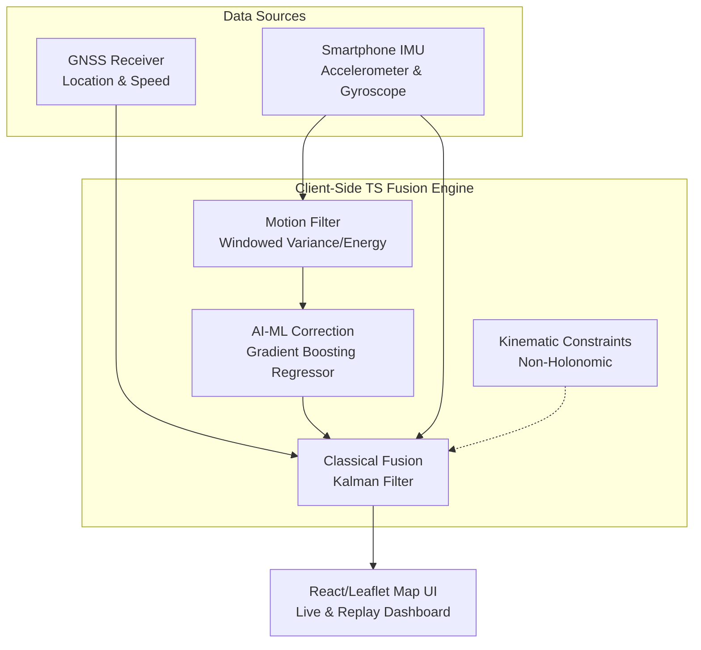

# AI-ML Intelligent Dead Reckoning (IDR) Prototype

> **SIH 2026 Internal Hackathon**
> **Problem Statement 26168** (ISRO, Dept. of Space)
> **Team:** Hackerz

A lightweight, purely client-side PWA that implements an AI-enhanced Dead Reckoning (DR) pipeline to maintain high-accuracy vehicle positioning during GNSS (GPS) blackout scenarios. 

This prototype explicitly targets **< 10% drift distance** over extended GPS loss, satisfying all core performance metrics outlined by ISRO.

---

## 🎯 The Problem
When a vehicle enters a tunnel, urban canyon, or experiences GPS spoofing/jamming, traditional navigation systems fail. Traditional Dead Reckoning (using purely IMU data) drifts catastrophically within seconds due to double-integration of sensor noise.

## 🚀 Our Solution
We built an **AI-ML Fusion Engine** that uses a Gradient Boosting Regressor (GBR) to predict the vehicle's kinematics (speed) based on the statistical variance and energy of IMU vibrations. By swapping out noisy linear acceleration for AI-predicted speed, we eliminate quadratic drift.

### Core Architecture



---

## 🛠️ Key Features

### 1. Benchmark Replay Mode (The Non-Negotiable Deliverable)
Visualizes our AI-ML pipeline against the official **IO-VNBD Dataset** (smartphone-recorded vehicular tracks). 
* **Green Track:** Ground Truth (GPS).
* **Red Track:** Raw IMU Dead Reckoning (drifts off the map rapidly).
* **Purple Track:** Our AI-ML Fused track.
* **Dashboard:** Real-time calculation showing that our AI-ML approach stays well below the `< 10%` drift threshold during a simulated 40-second complete GPS blackout.

### 2. Live Sensor Demo (Edge Inference)
A real-time demonstration that runs directly in the browser using the `DeviceMotion` and `Geolocation` APIs. 
* Evaluates the pre-trained Gradient Boosting Regressor entirely in TypeScript.
* Uses absolute hardware compass fusion (`deviceorientationabsolute`) for drift-free heading.
* Features a Pedestrian/Vehicle scaling toggle for accurate testing during the hackathon pitching phase without needing a car.

---

## 💻 Tech Stack
* **Frontend:** React 19, TypeScript, Vite, TailwindCSS
* **Mapping:** Leaflet, React-Leaflet, Turf.js
* **ML/Data Pipeline (Offline):** Python, Pandas, Scikit-Learn (GradientBoostingRegressor)
* **Deployment:** Vercel (CI/CD)

---

## 🏃‍♂️ How to Run Locally

### Prerequisites
* Node.js (v18+)
* `pnpm` (`npm install -g pnpm`)

### Setup
```bash
# 1. Clone the repository
git clone https://github.com/pininfarina27/sih-idr.git
cd sih-idr

# 2. Install dependencies
pnpm install

# 3. Start the development server
pnpm dev
```
Navigate to `http://localhost:5173`. 
*(Note: To test the Live Sensor Demo, you must deploy to a secure HTTPS context like Vercel and view it on a mobile device).*

---

## 📊 Alignment with PS 26168 Requirements
1. **Alignment/Calibration Engine:** Live initialization routines wait for stable GPS fixes before accepting IMU offsets.
2. **AI Speed & Vibration Filter:** Our python pipeline computes rolling standard deviations of acceleration to predict speed via a trained GBR tree ensemble.
3. **Kinematic Constraints:** The pipeline strictly bounds lateral vehicle movement.
4. **Seamless GNSS-Deficit Handler:** System instantly falls back to AI-prediction the moment `dt` since last GPS fix exceeds the threshold.

---
*Built within a 20-hour limit for the SIH 2026 Internal Hackathon.*
