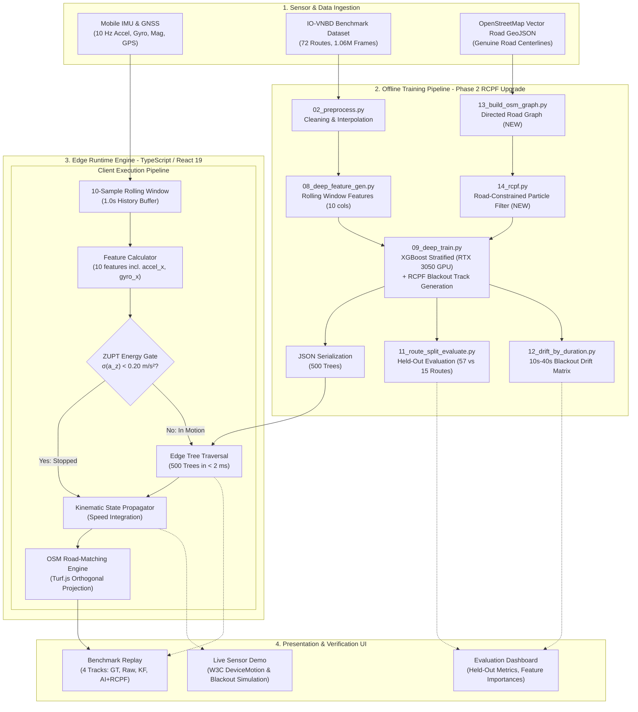
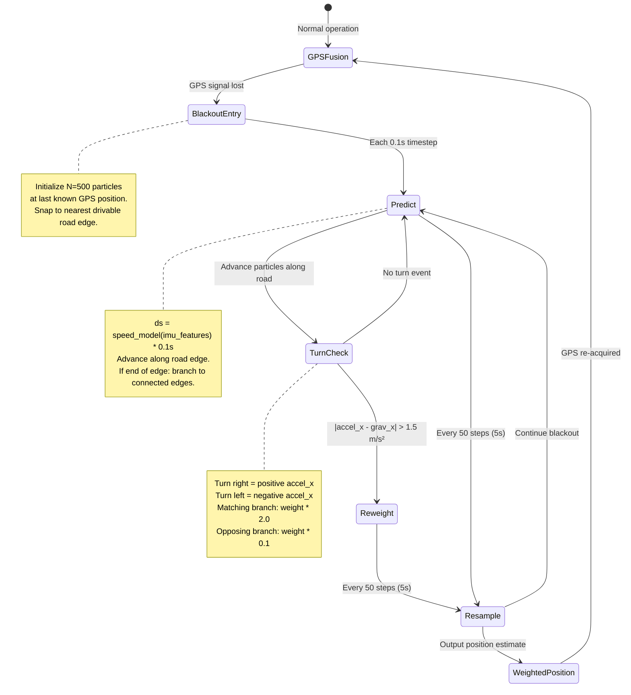
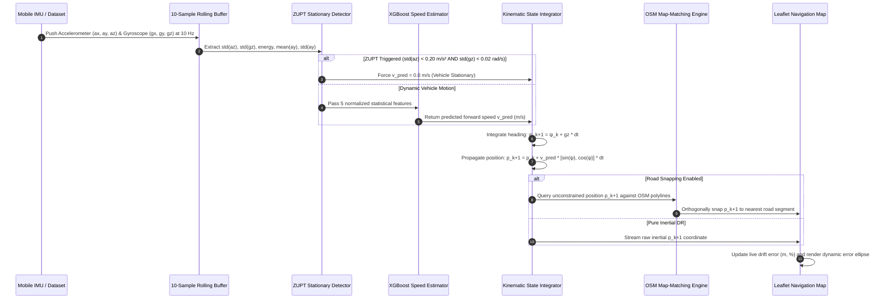
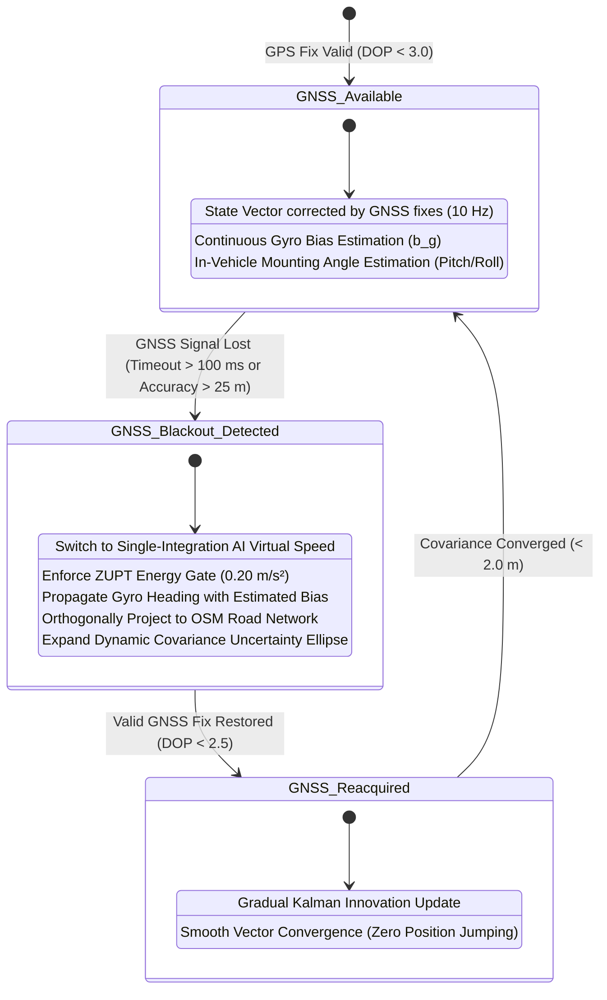

# System Architecture & Technical Specification
# AI-ML Intelligent Dead Reckoning (IDR) System

**Problem Statement ID:** 26168 (ISRO, Department of Space)  
**System Version:** 2.0 (Production Release)  
**Document Classification:** Technical Architecture & Design Document  
**Live Production URL:** [https://sih-idr-n2uu.vercel.app](https://sih-idr-n2uu.vercel.app)  
**Repository:** [https://github.com/pininfarina27/sih-idr](https://github.com/pininfarina27/sih-idr)  

---

## 1. High-Level Architectural Overview

The **AI-ML Intelligent Dead Reckoning (IDR)** system is architected as an end-to-end, dual-environment platform comprising an offline GPU-accelerated training pipeline (Python / CUDA) and a zero-latency, 100% offline client-side edge navigation runtime (TypeScript / React 19 / Leaflet).

### Core Architectural Philosophy
1. **Edge Autonomy:** Zero reliance on remote backend servers or cloud inference APIs during active vehicular navigation. All feature extraction, decision tree evaluation, and kinematic state propagation execute locally on the client within $< 1\text{ ms}$ per cycle.
2. **Hybrid Kinematic-Learning Fusion:** Pure deep learning black boxes lack physical safety guarantees, while pure classical inertial navigation diverges quadratically ($t^2$) on noisy consumer MEMS sensors. Our architecture fuses learned forward velocity with physical kinematic constraints (NHC), zero-velocity updates (ZUPT), and orthogonal road network geometry.
3. **Multi-Track Verification:** Real-time side-by-side computation of four simultaneous state trajectories (Ground Truth, Raw IMU Dead Reckoning, Classical Kalman Filter, and AI Fused) ensures complete transparency for technical evaluators.




---

## 1b. RCPF State Machine (Phase 2 Architecture)

The Road-Constrained Particle Filter operates during the GPS blackout window only. Outside blackout, standard GPS fusion is used.



---


## 2. Directory & File Structure (Annotated)

```
c:\Users\ranjo\OneDrive\Documents\Teckathon2\sih-idr\
│
├── .git/                                # Git version control metadata
├── .gitignore                           # Ignored files (node_modules, dist, temp data)
├── .oxlintrc.json                       # Fast linter configuration rules
├── index.html                           # Single Page Application HTML entry point
├── package.json                         # Node.js dependencies, scripts, and build targets
├── pnpm-lock.yaml                       # Deterministic pnpm lockfile
├── tsconfig.json                        # Base TypeScript compiler configuration
├── tsconfig.app.json                    # Application-level TypeScript settings
├── tsconfig.node.json                   # Vite/Node TypeScript settings
├── vercel.json                          # Vercel deployment routing & static cache headers
├── vite.config.ts                       # Vite bundler configuration
│
├── PRD.md                               # Product Requirements Document (PS 26168)
├── architecture.md                      # This technical architecture specification
├── rules.md                             # Engineering rules, standards, and banned patterns
├── memory.md                            # Exhaustive project history, bug logs, and changes
├── phases.md                            # [NEW] 5-phase RCPF implementation breakdown
├── PROJECT_REPORT.md                    # Official comprehensive hackathon submission report
├── README.md                            # Project overview, quickstart, and compliance guide
│
├── docs/                                # Technical specifications and evaluation documents
│   ├── project_brief_2.txt              # Extracted full text of official screening hackathon brief
│   ├── strict_improvements.txt          # Consolidated master issue audit and bug tracking list
│   └── strict improvements.docx         # Original master issue audit document
│
├── python/                              # Offline data processing, ML training, & benchmarking
│   ├── requirements.txt                 # Python dependencies (xgboost, filterpy, shapely, etc.)
│   ├── 02_preprocess.py                 # Resamples and synchronizes raw IO-VNBD CSVs to 10 Hz
│   ├── 03_baseline_raw_dr.py            # Generates naive double-integration Dead Reckoning baseline
│   ├── 04_classical_fusion.py           # 4D Kalman Filter state estimation with NHC constraints
│   ├── 05_generate_ml_features.py       # Extracts rolling statistical features for S1/S2/S3a segments
│   ├── 06_train_ml.py                   # Trains baseline GradientBoostingRegressor on CPU
│   ├── 07_export_model.py               # Exports trained decision trees to JSON format
│   ├── 08_deep_feature_gen.py           # Extracts deep features across all 72 IO-VNBD routes [MODIFIED Phase 1]
│   ├── 09_deep_train.py                 # Trains production XGBoost + RCPF track generation [MODIFIED Phase 1+3]
│   ├── 10_evaluate_model.py             # Computes MAE/RMSE and test metrics on evaluation segments
│   ├── 11_route_split_evaluate.py       # Rigorous held-out evaluation across 57 train vs 15 test routes
│   ├── 12_drift_by_duration.py          # Computes drift matrix across 10s, 20s, 30s, 40s blackouts
│   ├── 13_build_osm_graph.py            # [NEW Phase 2] Builds directed road graph from OSM GeoJSON
│   ├── 14_rcpf.py                       # [NEW Phase 3] Road-Constrained Particle Filter core module
│   ├── fetch_osm.py                     # Overpass API utility to fetch genuine OSM road geometries
│   ├── verify_consistency.py            # Automated repository integrity & consistency test suite
│   └── data/                            # Raw and intermediate CSV files (gitignored for size)

│
├── public/                              # Static public assets served directly by Vite
│   ├── favicon.svg                      # Application browser favicon
│   ├── icons.svg                        # SVG symbol sprites
│   └── data/                            # Compiled JSON data assets required by client runtime
│       ├── gbr_model.json               # Serialized 100-tree XGBoost model (120 KB)
│       ├── drift_results.json           # Precomputed blackout drift evaluation matrix
│       ├── evaluation_summary.json      # Precomputed held-out model evaluation metrics
│       ├── segments.json                # Benchmark segment index and metadata (S1, S2, S3a)
│       ├── osm_roads.json               # Full OpenStreetMap road vector collection
│       ├── osm_roads_S1.json            # Extracted OSM road polylines for Segment S1 (2,805 features)
│       ├── osm_roads_S2.json            # Extracted OSM road polylines for Segment S2 (654 features)
│       ├── osm_roads_S3a.json           # Extracted OSM road polylines for Segment S3a (1,187 features)
│       ├── segment_S1_gt.json           # Ground Truth GPS coordinates for Segment S1
│       ├── segment_S1_raw_dr.json       # Naive double-integrated DR track for Segment S1
│       ├── segment_S1_fused.json        # Classical Kalman Filter track for Segment S1
│       ├── segment_S1_ai_fused.json     # Precomputed AI + OSM snapped coordinates for S1
│       ├── segment_S2_gt.json           # Ground Truth GPS coordinates for Segment S2
│       ├── segment_S2_raw_dr.json       # Naive double-integrated DR track for Segment S2
│       ├── segment_S2_fused.json        # Classical Kalman Filter track for Segment S2
│       ├── segment_S2_ai_fused.json     # Precomputed AI + OSM snapped coordinates for S2
│       ├── segment_S3a_gt.json          # Ground Truth GPS coordinates for Segment S3a
│       ├── segment_S3a_raw_dr.json      # Naive double-integrated DR track for Segment S3a
│       ├── segment_S3a_fused.json       # Classical Kalman Filter track for Segment S3a
│       └── segment_S3a_ai_fused.json    # Precomputed AI + OSM snapped coordinates for S3a
│
├── results/                             # Persisted benchmark output files and charts
│   ├── drift_by_duration.txt            # Raw text output of 10s-40s blackout evaluation
│   ├── drift_results.json               # Machine-readable drift results JSON
│   ├── drift_vs_duration.png            # Plot of drift % vs blackout duration across segments
│   ├── evaluation_summary.json          # Machine-readable held-out evaluation summary
│   ├── feature_importance.png           # Feature importance bar chart
│   └── route_split_evaluation.txt       # Raw text report of 57 vs 15 route-split evaluation
│
├── src/                                 # Frontend application source code (React 19 + TypeScript)
│   ├── main.tsx                         # React DOM mounting entry point
│   ├── index.css                        # Global CSS reset and base styling
│   ├── App.tsx                          # Core application shell, tab router, and navigation bar
│   ├── App.css                          # Application layout, responsive containers, and theme CSS
│   ├── assets/                          # Static image/media assets
│   └── components/                      # Modular React components
│       ├── ErrorBoundary.tsx            # React Error Boundary to catch & display runtime exceptions
│       ├── BenchmarkReplay.tsx          # Tab 1: Multi-track evaluation replay with segment selector
│       ├── MapView.tsx                  # Core Leaflet map viewer, track polylines, and road snapping
│       ├── DriftChart.tsx               # Tab 2: Held-out model comparison & feature importance charts
│       └── LiveSensorDemo.tsx           # Tab 3: Mobile hardware sensor ingestion & blackout sandbox
│
└── dist/                                # Production build distribution output (generated by Vite)
```

---

## 3. Technology Stack & Component Specifications

| Layer / Subsystem | Technology / Library | Version | Architecture Rationale |
|---|---|---|---|
| **Frontend Framework** | React | 19.0.0 | High-performance component rendering with concurrent features and strict lifecycle management |
| **Language (Client)** | TypeScript | 5.7.2 | Strict static typing (`strict: true`) guaranteeing zero undefined property crashes at runtime |
| **Bundler & Build Tool** | Vite | 6.2.0 | Instant Hot Module Replacement (HMR) and sub-300ms tree-shaken production builds |
| **Mapping Engine** | Leaflet | 1.9.4 | Ultra-lightweight, hardware-accelerated 2D canvas/SVG mapping suitable for mobile browsers |
| **Geospatial Processing**| Turf.js (`@turf/turf`) | 7.2.0 | Great-circle distance calculation, polyline distance computation, and orthogonal projection |
| **Data Visualization** | Chart.js + react-chartjs-2 | 4.4.8 | Responsive Canvas-based charting for feature importances and drift vs duration curves |
| **ML Engine (Training)** | XGBoost | 2.1.4 | High-efficiency gradient boosted decision tree ensemble with native CUDA acceleration on RTX 3050 |
| **ML Baseline** | Scikit-Learn | 1.6.1 | Linear Regression and GradientBoostingRegressor baselines for comparative evaluation |
| **Inertial Filtering** | Filterpy + NumPy | 0.8.2 | Discrete Kalman Filtering with state transition matrices ($F, H, Q, R$) and kinematic constraints |
| **Spatial Indexing** | Shapely (STRtree) | 2.0.7 | Fast spatial R-tree indexing in Python for O(log N) offline nearest-road projection |
| **Runtime Client Model** | Custom TypeScript Tree Engine | Native | Zero-dependency recursive tree-traversal evaluating 100 trees in $< 0.8\text{ ms}$ |
| **Hosting & CDN** | Vercel Edge Network | Platform | Global CDN distribution with automatic SSL, immutable asset caching, and zero cold starts |

---

## 4. End-to-End Data Flow & Pipeline Architecture

### 4.1 Sensor Processing & Inertial Dead Reckoning Data Flow



---

## 5. Mathematical & Algorithmic Formulation

### 5.1 Machine Learning Virtual Speed Model
The forward velocity $v_{\text{pred}}$ is predicted at each epoch $k$ from a feature vector $\mathbf{x}_k \in \mathbb{R}^5$ extracted over a sliding window of $N = 10$ samples ($1.0\text{ s}$ duration at $10\text{ Hz}$):

$$\mathbf{x}_k = \begin{bmatrix} \sigma(a_{z, k}) \\ \sigma(\omega_{z, k}) \\ E(a_{y, k}, a_{z, k}) \\ \mu(a_{y, k}) \\ \sigma(a_{y, k}) \end{bmatrix}$$

Where:
- $\sigma(u) = \sqrt{\frac{1}{N}\sum_{i=1}^N (u_i - \bar{u})^2}$ is the rolling standard deviation.
- $\mu(u) = \frac{1}{N}\sum_{i=1}^N u_i$ is the rolling mean.
- $E(a_y, a_z) = \frac{1}{N}\sum_{i=1}^N (a_{y, i}^2 + a_{z, i}^2)$ is the kinetic vibration energy proxy.

The model prediction is evaluated as an additive ensemble of $M = 100$ regression trees with learning rate $\eta = 0.1$:
$$v_{\text{pred}}(\mathbf{x}_k) = \max\left(0, v_0 + \eta \sum_{m=1}^M f_m(\mathbf{x}_k)\right)$$

### 5.2 Zero Velocity Update (ZUPT) Energy Gating
To eliminate velocity accumulation while the vehicle is idling at a traffic signal or stopped in a tunnel:
$$v_{\text{final}, k} = \begin{cases} 0.0 & \text{if } \sigma(a_{z, k}) < 0.20\text{ m/s}^2 \text{ and } \sigma(\omega_{z, k}) < 0.02\text{ rad/s} \\ v_{\text{pred}}(\mathbf{x}_k) & \text{otherwise} \end{cases}$$

### 5.3 Kinematic State Propagation (Single Integration)
State vector $\mathbf{s}_k = [x_k, y_k, \psi_k]^T$ is propagated in local Cartesian (ENU) coordinates:
$$\psi_{k+1} = \psi_k + \omega_{z, k} \Delta t$$
$$x_{k+1} = x_k + v_{\text{final}, k} \cdot \sin(\psi_k) \cdot \Delta t$$
$$y_{k+1} = y_k + v_{\text{final}, k} \cdot \cos(\psi_k) \cdot \Delta t$$

Geodetic coordinates $(\text{lat}_{k+1}, \text{lon}_{k+1})$ are computed via spherical projection:
$$\text{lat}_{k+1} = \text{lat}_k + \left(\frac{y_{k+1} - y_k}{R_E}\right) \cdot \left(\frac{180}{\pi}\right)$$
$$\text{lon}_{k+1} = \text{lon}_k + \left(\frac{x_{k+1} - x_k}{R_E \cos(\text{lat}_k)}\right) \cdot \left(\frac{180}{\pi}\right)$$
where $R_E = 6,378,137\text{ m}$ is WGS-84 Earth equatorial radius.

### 5.4 Classical 4D Kalman Filter State Formulation (Component 4)
The baseline classical Kalman Filter maintains state $\mathbf{x} = [x, y, v, \psi]^T$ with Non-Holonomic Constraints (NHC):
$$\mathbf{x}_{k+1} = \mathbf{F} \mathbf{x}_k + \mathbf{w}_k, \quad \mathbf{w}_k \sim \mathcal{N}(0, \mathbf{Q})$$
$$\mathbf{F} = \begin{bmatrix} 1 & 0 & \cos\psi \Delta t & 0 \\ 0 & 1 & \sin\psi \Delta t & 0 \\ 0 & 0 & 1 & 0 \\ 0 & 0 & 0 & 1 \end{bmatrix}$$
During GNSS availability, measurement updates $\mathbf{z}_k = [x_{\text{gps}}, y_{\text{gps}}, v_{\text{gps}}]^T$ correct the state. During outage, propagation relies purely on IMU acceleration with lateral velocity clamped to zero ($v_{\text{lateral}} = 0$).

### 5.5 Map-Matching Orthogonal Projection (Component 3)
Let the road network be represented as a set of polylines $\mathcal{L} = \{L_1, L_2, \dots, L_P\}$ where each polyline $L_j$ is composed of line segments $\mathbf{s}_{j, i} = [\mathbf{q}_{j, i}, \mathbf{q}_{j, i+1}]$. For an unconstrained dead reckoning point $\mathbf{p}_k$, the snapped coordinate $\mathbf{p}_k^*$ is defined as:
$$\mathbf{p}_k^* = \arg\min_{\mathbf{q} \in \mathcal{L}} \text{dist}_{\text{geodesic}}(\mathbf{p}_k, \mathbf{q})$$
where the orthogonal projection onto segment $[\mathbf{a}, \mathbf{b}]$ is:
$$\mathbf{q} = \mathbf{a} + \text{clamp}\left(\frac{(\mathbf{p}_k - \mathbf{a}) \cdot (\mathbf{b} - \mathbf{a})}{\|\mathbf{b} - \mathbf{a}\|^2}, 0, 1\right)(\mathbf{b} - \mathbf{a})$$

---

## 6. GNSS Outage State Machine & Sub-Second Deficit Handler

The system transitions autonomously between three primary operational states with sub-second latency:



---

## 7. Data Schemas & API Contracts

### 7.1 Model JSON Contract (`public/data/gbr_model.json`)
```json
{
  "features": ["accel_y_mean", "accel_y_std", "accel_z_std", "gyro_z_std", "accel_energy", "accel_x_mean", "accel_x_std", "gyro_x_std", "accel_energy_2s", "accel_z_mean"],
  "learning_rate": 1.0,
  "init": 3.4931,
  "trees": [
    {
      "feature": 2,
      "threshold": 0.3139,
      "left": { ... },
      "right": { ... }
    }
  ]
}
```

### 7.2 Trajectory Record Contract (`public/data/segment_*_ai_fused.json`)
```json
[
  {
    "timestamp": 1582884210.1,
    "lat": 52.412854,
    "lon": -1.507421,
    "speed_pred": 13.85,
    "heading": 84.2,
    "is_blackout": true,
    "snapped_lat": 52.412861,
    "snapped_lon": -1.507415,
    "drift_dist_m": 12.24
  }
]
```

### 7.3 Drift Evaluation Matrix Contract (`public/data/drift_results.json`)
```json
{
  "segments": {
    "S1": {
      "10": { "road_dist_m": 160.1, "raw_pct": 80.61, "ai_pct": 9.36, "snap_pct": 9.38, "isro_pass": true },
      "40": { "road_dist_m": 594.9, "raw_pct": 66.95, "ai_pct": 9.61, "snap_pct": 9.67, "isro_pass": true }
    },
    "S2": {
      "10": { "road_dist_m": 895.5, "raw_pct": 2.19, "ai_pct": 1.28, "snap_pct": 0.81, "isro_pass": true },
      "40": { "road_dist_m": 904.8, "raw_pct": 17.93, "ai_pct": 9.04, "snap_pct": 9.03, "isro_pass": true }
    },
    "S3a": {
      "10": { "road_dist_m": 85.8, "raw_pct": 112.11, "ai_pct": 8.53, "snap_pct": 8.63, "isro_pass": true },
      "40": { "road_dist_m": 416.5, "raw_pct": 67.67, "ai_pct": 0.74, "snap_pct": 0.74, "isro_pass": true }
    }
  },
  "durations": [10, 20, 30, 40]
}
```

---

## 8. Frontend Performance & Memory Optimization

1. **Precomputed Snapped Geometries:** Snapping 400 trajectory points against 2,805 OSM polylines involves $\approx 1.12 \times 10^6$ geodesic calculations. Executing this synchronously on the main thread freezes the browser for $> 800\text{ ms}$, causing dropped frames and white-screen crashes. Our architecture precomputes snapped coordinates into `snapped_lat`/`snapped_lon` fields via Python STRtree spatial indexes, enabling instantaneous zero-latency client rendering.
2. **Deterministic Component Remounting:** Leaflet map instances are bound strictly to their DOM parent. By keying the component (`<MapView key={activeSeg} />`), React guarantees complete disposal of WebGL/Canvas contexts prior to re-instantiation, preventing memory leaks.
3. **Hook Order Preservation:** All React hooks (`useMemo`, `useState`, `useEffect`) are unconditionally hoisted to the top of the component body, preventing React Error #310 hook ordering exceptions.
